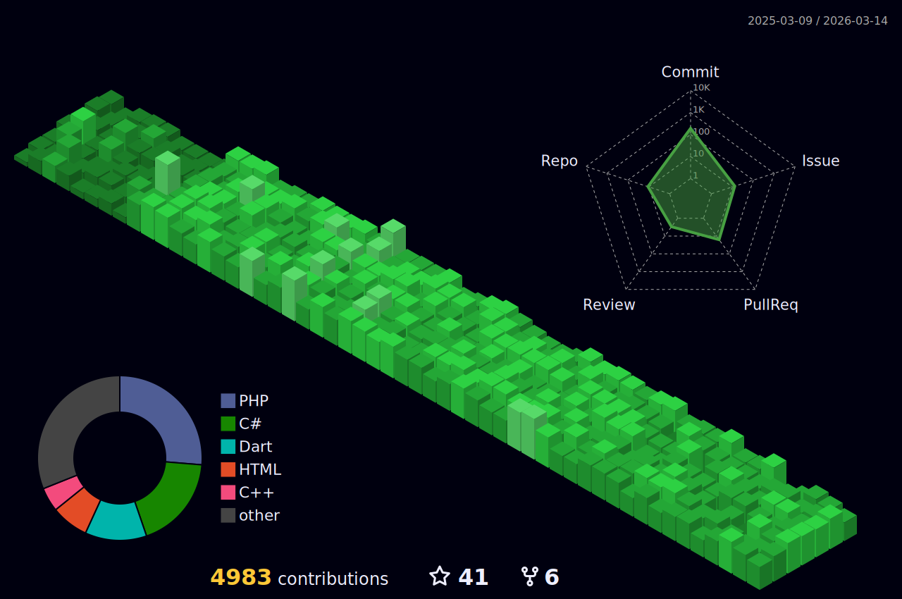

<!---
########################################
#                                      #
#             ThiagoSousa81            #
#                                      #
#            Copyright 2025            #
#     Todos os direitos reservados     #
########################################
--->

  

  

  
### 📚 Cursando <b>Bacharelado em Ciências Exatas e Tecnológicas</b> 🧮 na UFRB, com terminalidade em Engenharia da Computação 💻
### 👨‍💻 Técnico em Informática 📝🔧🪛 pelo CETEP Alberto Torres 🍎
  
### Por ser interessado no desenvolvimento de aplicações onde a <b>Segurança 🔐 da Informação</b> é uma <b>🚨 PRIORIDADE 🚨</b>, comecei o projeto [<b>EBS Security Systems</b>](https://github.com/EBS-Security-Systems)

### Sou Diretor de Vendas na [Recode Jr](https://github.com/recodejr), uma empresa júnior oficial de desenvolvimento de software na UFRB

#### Participo ativamente do Comitê Público do [INSTITUTO DE DEFESA CIBERNÉTICA](https://idciber.org/)

#### Estudando Sistemas Embarcados com um aprofundamento maior no [Embarcatech](https://embarcatech.cepedi.org.br/), promovido pelo CEPEDI, Softex e Governo Federal

#### Sou voluntário no PIBITI (Programa Institucional de Bolsas de Iniciação Tecnológica e Inovação) da [UFRB](https://github.com/ufrb), com o plano de trabalho "Integração e operacionalização de projeto piloto para monitoramento de articulação central e controle de movimento do veículo robótico PIPETA" no projeto "PIPETA - PLATAFORMA INTERDISCIPLINAR DE PESQUISA DE ESTUDOS DE TRANSPORTADORES AUTÔNOMOS" do professor [Nilton Silva](https://github.com/NiltonSilva10)

#### Participei de um programa de Iniciação Ciêntífica para Ensino Médio (PIBIC-EM) 🔬 na [UFRB](https://github.com/ufrb) intitulado "Estudo e desenvolvimento de um indicador de pontos para marcação de curva de nível para terrenos inclinados.", relacionado a área de Engenharia Eletrônica 🦾 🦿 🔋

### De forma individual, realizo pesquisas na área de criptografia, como <i>Criptógrafo-Analista</i>, onde procuro as melhores combinações de encriptação para projetos mais seguros, baseando-me em testes de <i>Criptoanálise</i>.

<h3>Para você que chegou aqui tome esse presente</h3>

<h2 align=center>Uma par de chaves RSA</h2>

  

<h2 align=center>Gráfico de Contribuíções</h2>

<h1 align="center">Conheça a <a href="https://ebs-systems.epizy.com/" target="_blank">EBS Security Systems</a></h1>

| 
<h3>Uma startup intensivamente focada no desenvolvimento de software seguro.     </h3>
 | 
<a href="https://github.com/EBS-Security-Systems/#readme" target="_blank">

</a>
 |
| --- | --- |

 
 
# Sobre mim...
<h3 align="center">Atualmente estou disponível para trabalhar em novos projetos de <b>Programação Multiplataforma, Automação, Sistemas Embarcados, Infraestrutura de Redes, Inteligência Artificial, Planejamento e Desenvolvimento de Sistemas </b></h3>

 
<h2 >Visualizações :heart:  
</h2> 

  

<!--prs_merged_percentage,-->

## Linguagens predominantes 

| Commits | Repositórios |
| --- | --- |
|  |  |

Obs.: Meu Git-Hub tem essas linguagens predominantes mas como um Dev multiplataforma posso me adaptar tranquilamente a desenvolver sistemas sólidos e escalonáveis em qualquer tecnologia.

## Status de contribuíções

| Contribuíções | Produtividade média |
| --- | --- |
|  |  |

## Troféus

<!---(ryo-ma/github-profile-trophy)--->

<!--- &row=2&column=3' --->

<!--- Tipos de projetos trabalhados --->

<h2 align="center">Portifólio</h2>

Aqui estão alguns repositórios de destaque no meu perfil. Aconselho que veja todos os outros projetos que já contribuí, se o que prcura for uma simples prova do meu trabalho

| Linguagem | Projetos |
| --- | --- |
|  | 
      
 |
|  | 
 
 |
|  | 
   
 |
|  | 
 
 |
|  | 
  
 |

 OBS.: Boa parte dos arquivos de projeto da EBS Systems são privados. Caso queira conhecer melhor do funcionamento interno entre em contato.

### [🕹️Tic Tac Toe](https://thiagosousa81.github.io/Tic-Tac-Toe/index.svg)

<h2 align=center>Projetos que participo</h2>

       
  <!-- Esse ficou ofuscado pela quantidade de projetos ativos no momento
   -->

> Última atualização: Janeiro/2025

 

 
  
  
   
  
  

  

    

<!---
ThiagoSousa81/ThiagoSousa81 is a ✨ special ✨ repository because its `README.md` (this file) appears on your GitHub profile.
You can click the Preview link to take a look at your changes.
--->
