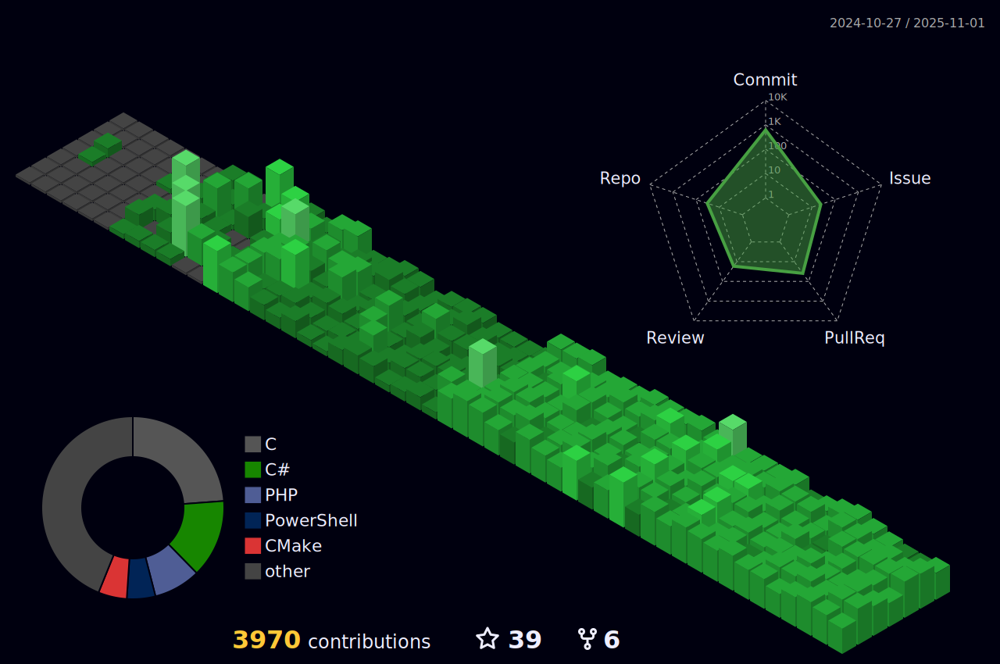

<!---
########################################
#                                      #
#             ThiagoSousa81            #
#                                      #
#            Copyright 2025            #
#     Todos os direitos reservados     #
########################################

--->

  

  
### 📚 Cursando <b>Bacharelado em Ciências Exatas e Tecnológicas</b> 🧮 na UFRB, com terminalidade em Engenharia da Computação 💻
### 👨‍💻 Técnico em Informática 📝🔧🪛 pelo CETEP Alberto Torres 🍎
  
### Por ser interessado no desenvolvimento de aplicações onde a <b>Segurança 🔐 da Informação</b> é uma <b>🚨 PRIORIDADE 🚨</b>, comecei o projeto [<b>EBS Security Systems</b>](https://github.com/EBS-Security-Systems)

### Sou Diretor de Vendas na [Recode Jr](https://github.com/recodejr), uma empresa júnior oficial de desenvolvimento de software na UFRB

#### Participo ativamente do Comitê Público do [INSTITUTO DE DEFESA CIBERNÉTICA](https://idciber.org/)

#### Estudando Sistemas Embarcados com um aprofundamento maior no [Embarcatech](https://embarcatech.cepedi.org.br/), promovido pelo CEPEDI, Softex e Governo Federal

#### Sou voluntário no PIBITI (Programa Institucional de Bolsas de Iniciação Tecnológica e Inovação) da [UFRB](https://github.com/ufrb), com o plano de trabalho "Integração e operacionalização de projeto piloto para monitoramento de articulação central e controle de movimento do veículo robótico PIPETA" no projeto "PIPETA - PLATAFORMA INTERDISCIPLINAR DE PESQUISA DE ESTUDOS DE TRANSPORTADORES AUTÔNOMOS" do professor [Nilton Silva](https://github.com/NiltonSilva10)

#### Participei de um programa de Iniciação Ciêntífica para Ensino Médio (PIBIC-EM) 🔬 na [UFRB](https://github.com/ufrb) intitulado "Estudo e desenvolvimento de um indicador de pontos para marcação de curva de nível para terrenos inclinados.", relacionado a área de Engenharia Eletrônica 🦾 🦿 🔋

### De forma individual, realizo pesquisas na área de criptografia, como <i>Criptógrafo-Analista</i>, onde procuro as melhores combinações de encriptação para projetos mais seguros, baseando-me em testes de <i>Criptoanálise</i>.
  

<h2 align=center>Gráfico de Contribuíções</h2>

<h1 align="center">Conheça a <a href="https://ebs-systems.epizy.com/" target="_blank">EBS Security Systems</a></h1>

|  |  |
| :---: | :---: |
| 
<h3>Uma startup intensivamente focada no desenvolvimento de software seguro.     </h3>
 | 
<a href="https://github.com/EBS-Security-Systems/#readme" target="_blank">

</a>
 |

 
 
# Sobre mim...
<h3 align="center">Atualmente estou disponível para trabalhar em novos projetos de <b>Programação Multiplataforma, Automação, Sistemas Embarcados, Infraestrutura de Redes, Inteligência Artificial, Planejamento e Desenvolvimento de Sistemas </b></h3>

 
<h2 >Visualizações :heart:  
</h2> 

## Linguagens predominantes 

<!---->

<!---->

Obs.: Meu Git-Hub tem essas linguagens predominantes em <i>commits</i> mas também programo em outras linguagens, como C#, Python, R, Fortran e JavaScript.

## Status de contribuíções

<!---->

## Troféus

<!---(ryo-ma/github-profile-trophy)--->

<!--- &row=2&column=3' --->

<!--- Tipos de projetos trabalhados --->

<h2 align="center">Portifólio</h2>

- 
 
<h3>C#</h3> 

 
  

  

  

  

  

- 
 
<h3>PowerShell</h3> 

 
  
  

- 
 
<h3>Python</h3> 

 
  
  
  

  

  

  
  

- 
 
<h3>JavaScript</h3> 

  
  
  
  

- 
 
 <h3>PHP</h3> 

  

  

  

  OBS.: Boa parte dos arquivos de projeto da EBS Systems são privados. O website é o único que ainda está público

  

<h2 align=center>Projetos que participo</h2>

       

<!--
## Área técnica...

Clique para visualizar

### Trabalho em projetos relacionados a...

📝

  
- ⚙️ Automação comercial ⚙️
- 🔐 Segurança da informação 🔐
- 🤖 Aprendizado de máquina 🤖
- 🧐 Análise de sistemas 🧐
- ✅ Qualidade de software ✅
- 💰 Empreendedorismo digital 💰
  

<!--- Meus Framewoks 
                                        
### Desenvolvo com os Frameworks...

🧰

  
- .NET Framework
- .NET Core
- .NET - WPF
- Bootstrap
  
### Pretendo aprender os Frameworks...
- ASP.NET       
- JOOQ <code>// prioridade</code>
- Angular
- TypeScript
- Laravel
- React Native
- React JS
- Vue.js
- Flutter
- Node.js
- Unity Test Framework
  

<!--- Minhas linguagens de programação 

### Programo nas linguagens...

😜

  
> Realmente os emojis podem sistematizar qualquer coisa
  
| Linguagem | Nível de aprendizado | Tempo de trabalho com a linguagem |
| --------- | ------------ | ------ |
| 🏆 SQL | Sênior | 3 anos |
| 🥇 C# | Sênior | 3 anos |
| 🥈 Python | Pleno | 2 anos |
| 🥉 PHP | Pleno | 2 meses |
| Java | Pleno | 10 meses |
| R | Júnior | 4 meses |
| HTML | Pleno | 1 ano |
| CSS | Pleno | 3 meses |
| Java Script | Júnior | 2 meses |
| XML | Júnior | 2 anos |
| Visual Basic | Júnior | Estudei por 3 meses mas parei | 
| C++ | Aprendiz | 1 mês |
| C | Aprendiz | 1 mês |
| Fortran (😅 gosto de antiguidades) | Aprendiz | Estudei por 1 mês mas parei (voltarei a estudá-la. Uma companhia cairia bem 🤝) |

> Outras linguagens que conheço (linguagens contextuais)...
  
| Linguagem | Nível de aprendizado | Tempo de trabalho com a linguagem |
| --------- | -------------------- | ------ |
| 🥇 Basic (Microsoft Small Basic) | Sênior | 3 anos |
| 🥈 C# (PowerShell cmdlets) | Sênior | 2 anos |
| 🥉 Bat (CMD) | Pleno | 2 anos |
| Minecraft Cheats | Pleno | 2 anos |
| Portugol (VisualG) | Júnior | 2 anos |
| Git | Aprendiz | 1 ano |

> **OBS.: Linguagens atualizadas em Jan/2023**

<!--- Experiência com Ferramentas 

### Tenho experiência com ferramentas... 

🛠️

  
#### Para desenvolvimento e análise de algoritmos de encriptação 📜 🔐 🔍

Ferramentas

  
- Encryption's Builder Studio (desenvolvido por mim)
  

#### Para desenvolvimento de Redes de Computadores 📡

Ferramentas

  
- Cisco Packet Tracer
  

#### Para desenvolvimento web 🌐

Ferramentas

  
- Git-Hub Codespaces
- VS Code
- PyCharm
- Scratch (Considero um redirecionamernto ao aprendizado do Java Script)
- Online GDB
- Bootstrap
- WordPress
- Nicepage
- Template Toaster
  

#### Para desenvolvimento em desktop 🖥️

Ferramentas

  
- IDLE Python
- PowerShell ISE (incluindo CMD)
- PS Script Pad (Editor visual de formulários C# em PowerShell)
- Microsoft Visual Studio Community
- Microsoft Small Basic
- Small Basic CLI (Desenvolvido por mim)
- Godot (tive pouco tempo com ele, mas aprendi o essencial)
  

#### Para desenvolvimento Android 📲

Ferramentas

  
- PyDroid
- AppInventor
- Kodular Code

Obs.: Ainda não trabalho com aplicativos para celular pois tenho muito o que aprender nessa área!
  

#### Para ciência de dados 🎲

Ferramentas

  
- R Studio Cloud
- phpMyAdmin
- SQLite
- Microsoft SQL Server
- MySQL
- brModelo
- Microsoft Access
  

#### Para gestão de eficiente de e-mails de domínios 📩

Ferramentas

  
- Microsoft Outlook 2019
- Gmail
  

  
#### Para hospedagem gratuita ☁️

Ferramentas

  
- Infinity Free
- Google Drive (Hospedagem simples e fácil para iniciantes)
  

-->

### Para mais informações visite meu site: https://thiagosousa81.wordpress.com/  
> Última atualização: Julho/2023

 
 
  
  
   
    

    

  

<!---
ThiagoSousa81/ThiagoSousa81 is a ✨ special ✨ repository because its `README.md` (this file) appears on your GitHub profile.
You can click the Preview link to take a look at your changes.
--->
